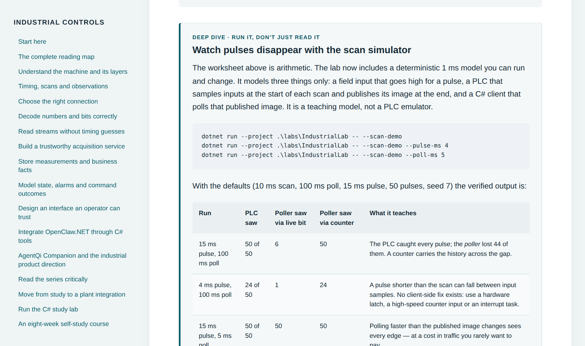

# Industrial Controls Tutorial for C# Developers

A free, self-paced course on industrial software for .NET developers. It covers PLC scan cycles, Modbus TCP, OPC UA, MQTT, SCADA, alarms and historians, with 14 hands-on labs you run on your own machine. No PLC or other hardware is needed: a simulated tank and Modbus device stand in for the plant.


[](LICENSE)
[](LICENSE-CONTENT.md)



## Who it's for

C# developers who are new to operational technology (OT) and want to build software that reads from PLCs, feeds dashboards and historians, or connects plant data to AI agents. You should be comfortable with basic C#. Everything about the plant side is explained from scratch.

## What you'll learn

| Topic | What you build or measure |
| --- | --- |
| PLC scan cycles and timing | Run a scan simulator and watch a 100 ms poll miss 44 of 50 pulses that the PLC caught |
| Modbus TCP | Poll a simulated device over a real socket, decode its register map, handle exception codes |
| Byte order and data types | Decode float32 in four word orders, uint32, scaled int16 and packed status bits |
| TCP framing | Parse responses correctly when the network splits them into single bytes |
| Data quality | Detect stale data, dropped links and a device that answers with frozen values |
| Alarms (ISA-18.2 style) | Build an alarm with hysteresis and acknowledgement that never clears on bad data |
| Historians | Store samples in SQLite, find gaps and see a one-minute average hide a 6 °C spike |
| MES integration | Deliver a batch event once in effect across a lost reply and a restart |
| Operator screens (ISA-101 style) | Build a dashboard that stays truthful when the link drops |
| AI agents | Expose the simulator as MCP tools for [OpenClaw.NET](https://github.com/clawdotnet/openclaw.net) and score the agent's answers |

OPC UA and MQTT are covered in the reading material as architecture choices; the labs use Modbus TCP because it is the simplest protocol to see on the wire.

## Quick start

Reading needs only a browser. The labs need the [.NET 10 SDK](https://dotnet.microsoft.com/download) and internet access for the first NuGet restore. The optional checker scripts need Python 3.

```powershell
git clone https://github.com/Telli/industrial-controls-tutorial
cd industrial-controls-tutorial

# 85 automated checks; ends with "All 85 checks passed."
dotnet run --project ./labs/IndustrialLab -- --self-test

# Start the simulator with its Modbus TCP device
dotnet run --project ./labs/IndustrialLab -- --modbus
```

The simulator serves HTTP on `http://localhost:5088`, MCP tools on `/mcp` and a Modbus TCP device on `127.0.0.1:5502`. In a second terminal, poll the device:

```powershell
dotnet run --project ./labs/IndustrialLab -- --poll --count 5
```

Each line is one Modbus request. These excerpts come from the Lab 14 drills, where the device first answers normally, then keeps answering with frozen values, then goes silent:

```text
time         tid   quality           temp(f32)  temp(x10)  setpoint  state    hb     seq      rtt  detail
16:52:45.664     2 Good                 36.923       36.9      60.0  Heating     26       26     4ms OK
16:52:50.264     4 Stale                40.790       40.8      60.0  Heating     37       37     3ms Heartbeat 37 unchanged for 3 polls
16:52:52.415     1 BadCommunication          -          -         -  -            -        -   511ms No complete response within 500 ms
```

The frozen device still replies in 3 ms, so only the heartbeat register reveals the problem. The silent device produces no error at all, so only the deadline does.

## Read the course

The course is two sets of HTML pages. GitHub shows HTML as source code, so clone or download the repository (**Code → Download ZIP**) and open the files in a browser.

- **[Handbook](Industrial-Controls-Tutorial.html)**: 17 chapters, a guided workbook for all 14 labs with expected output and troubleshooting, an eight-week study plan, a device register map and an annotated reading list.
- **[Article library](english-articles/index.html)**: 12 shorter study articles, each with a hands-on section. Also available as [one page](english-articles/all-articles.html) and as [plain text](english-articles/all-articles.txt).

## The labs

| # | Lab | Type |
| --- | --- | --- |
| 1 | Responsibility map: who owns safety, control, supervision and advice | Design |
| 2 | Timing and scans: missed pulses and the counter fix | Simulation |
| 3 | Device contract: write a register map two people decode the same way | Design |
| 4 | Decoder: test fixtures and a deliberate bug the tests must catch | Code |
| 5 | TCP fragmentation over a real socket | Code + live |
| 6 | Stale data: prove old values are never presented as new | Live |
| 7 | Historian in SQLite, with a C# writer template | SQL + C# |
| 8 | Alarm lifecycle: hysteresis, acknowledgement, bad quality | Code + live |
| 9 | Operator dashboard, from a console starter | Build |
| 10 | MES outbox and idempotent delivery | Code |
| 11 | Connect the tools to an AI agent and score its answers | Integration |
| 12 | Firmware and register-map upgrades without wrong data | Design + live |
| 13 | Modbus TCP end to end | Live |
| 14 | Communication failure drills | Live |

Start with [`START-HERE.txt`](START-HERE.txt), then follow Appendix C of the handbook.

## Repository layout

```text
Industrial-Controls-Tutorial.html   the handbook
english-articles/                   12 study articles (HTML and plain text)
labs/IndustrialLab/                 C# simulator, Modbus device and poller, labs, self-tests
labs/DashboardStarter/              console dashboard starter (Lab 9)
labs/historian/                     SQLite schema, queries and checker (Lab 7)
labs/verify-labs.py                 live checks against the running simulator
labs/openclaw-mcp.example.json      MCP client configuration fragment for OpenClaw.NET
sources.json                        source articles and technical references
VERIFICATION.txt                    what was tested, and what was not
```

## Safety and scope

The simulator runs on your machine only and never connects to real equipment. The Modbus device listens on the loopback address and refuses every write. The agent tools can propose a setpoint change but never execute one. This is a study resource. It does not replace the safety engineering, testing and review that real plant software requires.

## Sources and attribution

The course follows nine articles in Wackysoft's industrial-controls series on CNBlogs and three follow-up troubleshooting articles, starting with [the first article in the series](https://www.cnblogs.com/wackysoft/p/22144512). The English editions contain short summaries of each source and independently written lessons. They are not translations, and the original articles and images are not included. [`sources.json`](sources.json) lists every source article and technical reference.

This is an independent project and is not affiliated with Wackysoft, CNBlogs or any standards body.

## License

The code in `labs/` is under the [MIT License](LICENSE). The handbook, articles and images are under [CC BY 4.0](LICENSE-CONTENT.md): you can reuse and adapt them, including in your own courses, as long as you credit this repository. The linked source articles belong to their authors and are not covered by either license.
